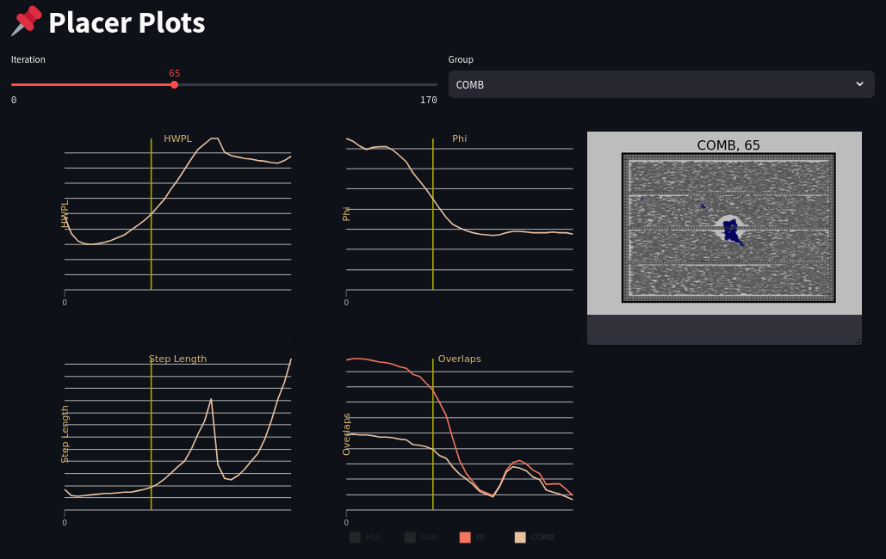
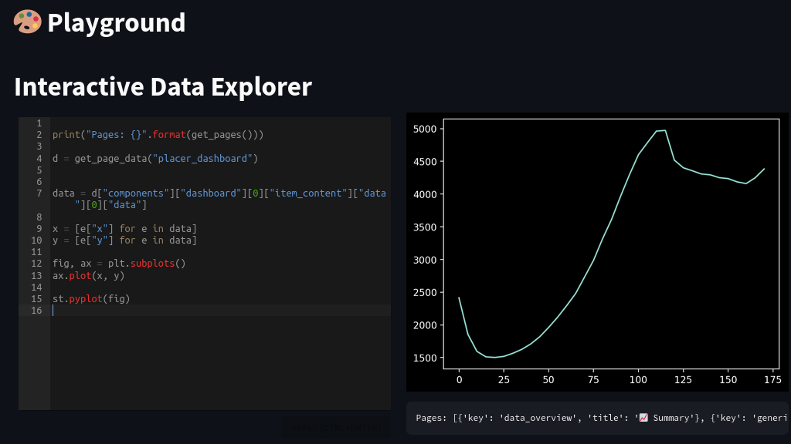
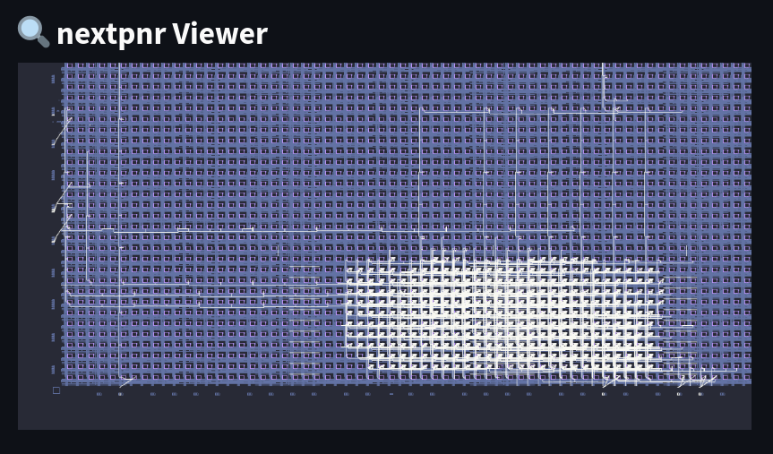

#   pnrXplore-viewer

pnrXplore-viewer is a Web-based viewer for bundles created with [pnrXplore](https://github.com/meiniKi/pnrXplore). It can be run natively or in a Docker container.

> [!TIP]
> More information can be found [here](https://github.com/meiniKi/pnrXplore).

## Quick Start

### Run Natively

```bash
python3 -m venv .venv
source .venv/bin/activate
pip install -e .
streamlit run pnrXplore_viewer/pnrXplore.py --server.maxUploadSize 2048
```

`--server.maxUploadSize` allows to set the maximum size of a bundle that can be uploaded. This is especially important when pnrXplore is locally hosted to quickly inspect very large bundle sizes.

### Run in Docker Container

```bash
docker compose up -d
```

### Example Pages and Components

**Placer Dashboad**: Plots and placement solution are synchronized to the _state_ given by the current iteration and primitive type.




**Placer Renderings**: Dashboard with renderings for each placer iteration and primitive type.


**Python Playground**: Run Python code interactively on the bundled data.



**nextpnr Viewer**: Embedded nextpnr viewer with routed implementation result.

