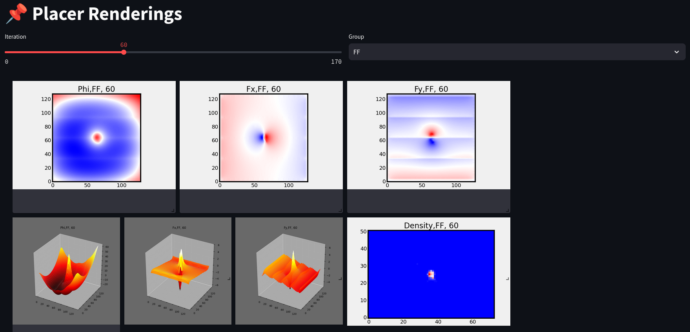

# pnrXplore-viewer

pnrXplore-viewer is a Web-based viewer for bundles created with pnrXplore. It can be run natively or in a Docker container.

## Quick Start

### Run Natively

```bash
python3 -m venv .venv
source .venv/bin/activate
pip install -e .
streamlit run pnrXplore_viewer/pnrXplore.py
```

### Run in Docker Container

```bash
docker compose up -d
```

### Example Pages and Components

**Placer Dashboad**: Plots and placement solution are synchronized to the _state_ given by the current iteration and primitive type.


**Placer Renderings**: Dashboard with renderings for each placer iteration and primitive type.




**Python Playground**: Run Python code interactively on the bundled data.


**nextpnr Viewer**: Embedded nextpnr viewer with routed implementation result.

